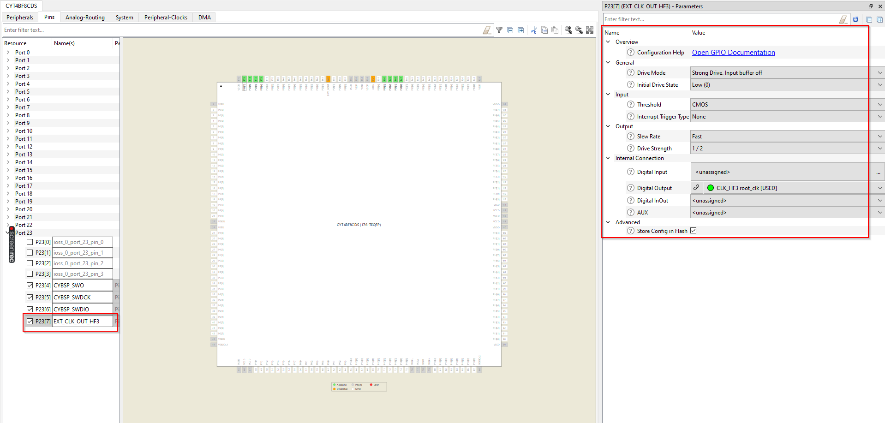
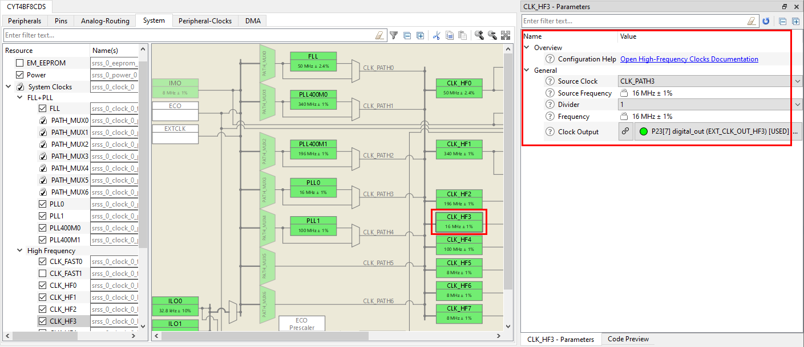
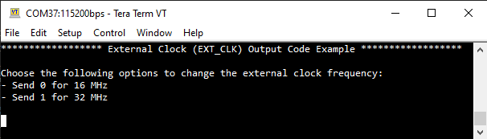

# External Clock Output

**This code example demonstrates how to use the clock output feature which routes clock CLK_HF3 to an external pin.**

## Requirements

- [ModusToolbox&trade;](https://www.infineon.com/modustoolbox) v3.0 or later (tested with v3.0)

## Supported toolchains (make variable 'TOOLCHAIN')

- GNU Arm&reg; Embedded Compiler v11.3.1 (`GCC_ARM`) – Default value of `TOOLCHAIN`

## Device

The device used in this code example (CE) is:
- [TRAVEO™ T2G CYT4BF Series](https://www.infineon.com/cms/en/product/microcontroller/32-bit-traveo-t2g-arm-cortex-microcontroller/32-bit-traveo-t2g-arm-cortex-for-body/traveo-t2g-cyt4bf-series/)

## Board

The board used for testing is:
- TRAVEO™ T2G evaluation kit ([KIT_T2G-B-H_LITE](https://www.infineon.com/evaluation-board/KIT-T2G-B-H-LITE))

## Scope of work

In this example a pin will be configured to output the clock CLK_HF3. The user will be able to change the frequency of CLK_HF3 during runtime. In a real application this feature can be used for supplying external components with a clock signal or for diagnostic/debugging purposes like monitoring an internal clock signal on a port pin.

## Introduction

TRAVEO™ T2G Body devices provide a functionality where a pin can be employed either as an input for receiving clock signals or as an output to transmit clock signals. This particular pin is referred to as the EXT_CLK pin.

The EXT_CLK pin is bi-directional. To utilize the EXT_CLK pin as an input, the process involves configuring the HSIOM (High-Speed Input/Output Matrix) to designate the EXT_CLK signal for a compatible pin and subsequently setting the respective GPIO (General Purpose Input/Output) to the high impedance digital drive mode. On the other hand, to make use of the EXT_CLK pin as an output, the procedure entails configuring the HSIOM to assign the EXT_CLK signal to a suitable pin and configuring the GPIO to a mode that can effectively transmit clock signals at the desired frequency.

The clock source accessible through the EXT_CLK pin is clock CLK_HF3. This clock source has the flexibility to select from various internal clock sources, including the ECO (External Crystal Oscillator). It is important to note that CLK_HF3 is a resource that is shared among different components. Any alterations made to its settings will have an impact on all the connections utilizing this clock source.

More details of TRAVEO™ T2G CYT4BF Series can be found in Technical Reference Manual (TRM), Registers TRM and Data Sheet. (See the [here](https://www.infineon.com/products/microcontroller/32-bit-traveo-t2g-arm-cortex/for-body/t2g-cyt4bf#documents))

## Hardware setup

This CE has been developed for:
- TRAVEO™ T2G evaluation kit lite ([KIT_T2G-B-H_LITE](https://www.infineon.com/evaluation-board/KIT-T2G-B-E-LITE)) 
 
No changes are required from the board's default settings. Connect an oscilloscope to pin 8 of the J4 connector for the purpose of observing the EXT_CLK clock signal. Please refer to the board schematic for more details on the connector pinout.

## Implementation

**STDOUT/STDIN setting**

Initialization of the GPIO for UART is done in the <a href="https://infineon.github.io/retarget-io/html/group__group__board__libs.html#gaddff65f18135a8491811ee3886e69707"><i>cy_retarget_io_init()</i></a> function.
- Initializes the pin specified by *CYBSP_DEBUG_UART_TX* as UART TX and the pin specified by *CYBSP_DEBUG_UART_RX* as UART RX (these pins are connected to KitProg3 COM port)
- The serial port parameters are 8N1 and 115200 baud

**External Clock Output**

TRAVEO™ T2G CYT4BF Series enables the option to direct the EXT_CLK signal to three specific pins:
- P21.2
- P23.7
- P24.0

For the purpose of illustration, in this instance, Pin 23.7 is employed. This corresponds to pin 8 on the J4 connector, commonly known as the SWD/JTAG connector.

Following steps show the configuration to be done to route EXT_CLK (CLK_HF3) to the pin.

**Step 1: Configure GPIO**

Set up the pin to function as an output for EXT_CLK. The provided image illustrates the process using the Device Configurator tool. 
Select the pin P23.7. The drive mode *Strong drive, Input buffer off* should be selected to configure the pin as an output. Digital output *CLK_HF3 root clk* has to be selected so that the HSIOM routes the clock CLK_HF3 to the selected pin. 

By performing this configuration, the clock CLK_HF3 is directed to the pin. Output frequency can be adjusted by modifying the PLL dividers, similar to the procedure outlined in step 2.
 
 *Figure 1. Pin configuration* 
 

**Step 2: Configure CLK_HF3**

Clicking on the *System* tab in the device configurator shows the clock tree of the device. Here the source clock for CLK_HF3 can be selected. For this example we choose PLL0 which is analogous to PLL200_0, which is CLK_PATH3. The configuration also provides clock dividers from 1 - 8, but in this case we leave it at 1 (no division).

*Figure 2. CLK_HF3 configuration* 

**Step 3: Configure PLL**

CLK_PATH3 is selected as the input source for CLK_HF3. This means that PLL200_0 feeds the CLK_HF3 and the output frquency of the external clock can be changed by changing the dividers in PLL200_0. 

There are two methods for configuring the PLL: one involves utilizing the Device Configurator, while the other is using the Peripheral Driver Library:

- Device configurator
  
  Select the *System* tab and then PLL0. The desired frequency can be set, the dividers are automatically calculated. It is important to highlight that CLK_HF3 can handle a maximum frequency of 100 MHz.

  *Figure 3. PLL configuration* 
  

- Peripheral Driver Library

  Within the *main.c* file, two configurations are present for producing frequencies of 16 MHz and 32 MHz. This is achieved using the Peripheral Driver Library. Each configuration involves setting dividers to achieve the desired output frequency. 
  In order to modify the PLL frequency, the initial step involves disabling the PLL using <a href="https://infineon.github.io/mtb-pdl-cat1/pdl_api_reference_manual/html/group__group__sysclk__pll__funcs.html#ga0dab90271e8887833424c8fc280a1f30"><i>Cy_SysClk_PllDisable()</i></a>
  Following this, the desired frequency is applied via <a href="https://infineon.github.io/mtb-pdl-cat1/pdl_api_reference_manual/html/group__group__sysclk__pll__funcs.html#gad21ad8110bfc4506947fbd0fb163d055"><i>Cy_SysClk_PllManualConfigure()</i></a>.
  Consequently, the PLL registers will reflect the dividers in accordance with the chosen configuration. Finally, the PLL must be re-enabled using <a href="https://infineon.github.io/mtb-pdl-cat1/pdl_api_reference_manual/html/group__group__sysclk__pll__funcs.html#ga5396ed00cc7ddeeb924bf00ee08311e5"><i>Cy_SysClk_PllEnable()</i></a>.

  The output frequency of the PLL is controlled by the following formula:

  `(Input Frequency / Reference Divider) * Feedback Divider / Output Divider`

Refer the section 18.3 of the TRM for more information on using the PLL.

## Run and Test

For this example, a terminal emulator is required for displaying outputs and to change settings during runtime. Install a terminal emulator if you do not have one. Instructions in this document use [Tera Term](https://teratermproject.github.io/index-en.html).

After code compilation, perform the following steps for flashing the device:
1. Connect the board to your PC using the provided USB cable through the KitProg3 USB connector.
2. Open a terminal program and select the KitProg3 COM port. Set the serial port parameters to 8N1 and 115200 baud.
3. Program the board using one of the following:
    - Select the code example project in the Project Explorer.
    - In the **Quick Panel**, scroll down, and click **[Project Name] Program (KitProg3_MiniProg4)**.
4. After programming, the code example starts automatically. Confirm that the messages are displayed on the UART terminal:

   *Figure 4. Terminal output on program startup* 
   
   
5. Sending the value 0 switches the output frequency on the EXT_CLK pin to 16 MHz and value 1 makes the output 32 MHz.

6. You can debug the example to step through the code. In the IDE, use the **[Project Name] Debug (KitProg3_MiniProg4)** configuration in the **Quick Panel**. For details, see the "Program and debug" section in the [Eclipse IDE for ModusToolbox™ software user guide](https://www.infineon.com/MTBEclipseIDEUserguide).

**Note:** **(Only while debugging)** On the CM7 CPU, some code in *main()* may execute before the debugger halts at the beginning of *main()*. This means that some code executes twice: once before the debugger stops execution, and again after the debugger resets the program counter to the beginning of *main()*. See [KBA231071](https://community.cypress.com/docs/DOC-21143) to learn about this and for the workaround.

## References  

Relevant Application notes are:
- [AN235305](https://www.infineon.com/assets/row/public/documents/10/42/infineon-an235305-getting-started-with-traveo-t2g-family-mcus-in-modustoolbox-applicationnotes-en.pdf?fileId=8ac78c8c8b6555fe018c1fddd8a72801) - GETTING STARTED WITH TRAVEO™ T2G FAMILY MCUS IN MODUSTOOLBOX™
- [AN224434](https://www.infineon.com/gated/infineon-an224434-clock-configuration-setup-in-traveo-t2g-body-high-family-applicationnotes-en_80cf38a4-3eb2-43d9-b7fb-8ec94120dfd2) - CLOCK CONFIGURATION SETUP IN TRAVEO™ T2G BODY HIGH FAMILY

ModusToolbox™ is available online:
- <https://www.infineon.com/modustoolbox>

Associated TRAVEO™ T2G MCUs can be found on:
- <https://www.infineon.com/cms/en/product/microcontroller/32-bit-traveo-t2g-arm-cortex-microcontroller/>

More code examples can be found on the GIT repository:
- [TRAVEO™ T2G Code examples](https://github.com/orgs/Infineon/repositories?q=topic%3Akit-t2g-b-h-lite&type=all&language=&sort=) for [KIT_T2G-B-H_LITE](https://www.infineon.com/evaluation-board/KIT-T2G-B-H-LITE)

For additional trainings, visit our webpage:  
- [TRAVEO™ T2G trainings](https://www.infineon.com/training/microcontroller-trainings)

For questions and support, use the TRAVEO™ T2G Forum:  
- <https://community.infineon.com/t5/TRAVEO-T2G/bd-p/TraveoII>  
